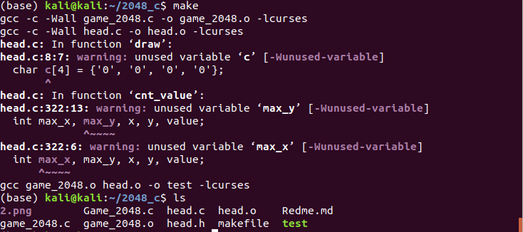
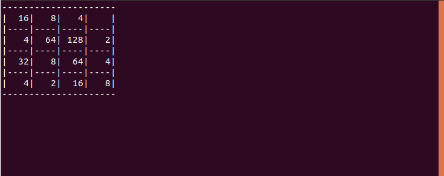
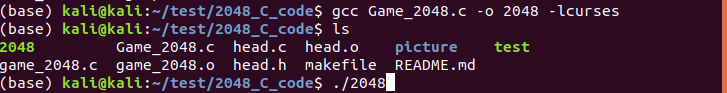

# 2048_C_code
用C语言编写的2048

# 1

## 基础知识

**要实现我们的 2048 小游戏，需要涉及一些数据结构的知识，以及一些 Linux 的系统调用。此外，为了方便在屏幕上使用字符绘图，我们还需要使用一个文本界面的屏幕绘图库 ncurses ，具体到操作就是在编译的时候需要加上 -lcurses 选项。**
安装ncurses库：
`sudo apt-get install libncurses5-dev`

## 设计思路

**要实现 2048 游戏目前有两个关键点：**

1. 在满足条件情况下消除方块
2. 允许在游戏主界面（16 宫格）中任意一格输出数据
   其中第二点借助 ncurses 库可以较容易实现，但是第一点要稍微麻烦些。第一点的实现思路是，我们创建一个与游戏地图相同维数的数组矩阵，通过数组矩阵来维护 2048 游戏中每个格子的数据与状态，从而玩家的移动操作都可以映射为对数组矩阵的操作。

## 基础工作

1. 引头文件
   编写自己的头文件head.h。
   添加库函数头文件：

```c
#include <stdio.h>
#include <stdlib.h>
#include <curses.h>
#include <unistd.h>
#include <signal.h>
#include <time.h>
```

2. 创建函数

```c
void draw(); //用于绘制游戏界面
void play(); //游戏运行的逻辑主体
void init(); //初始化函数，用于完成一些必要的初始化操作
void draw_one(int y, int x); //绘制单个数字
void cnt_value(int *new_y, int *new_x);
int game_over(); //结束游戏
int cnt_one(int y, int x);
```

3. 编写函数
   创建函数文件head.c。
   添加函数的内容。

```c
#include "head.h"
int a[4][4] = {0};
int empty;
int old_y, old_x;
void draw()
{
	int n, m, x, y;
	char c[4] = {'0', '0', '0', '0'};
	clear();
	for(n=0;n<9;n+=2)
	{
		for(m=0;m<21;m++)
		{
			move(n, m);
			addch('-');
			refresh();
		}
	}
	for(m=0;m<22;m+=5)
	{
		for(n=1;n<8;n++)
		{
			move(n,m);
			addch('|');
			refresh();
		}
	}
	for(y=0;y<4;y++)
	{
		for(x=0;x<4;x++)
		{
			draw_one(y, x);
		}
	}
}
void play()
{
	int x, y, i, new_x, new_y, temp;
	int old_empty, move;
	char ch;

	while(1)
	{
		move = 0;
		old_empty = empty;
		ch = getch();
		switch(ch) {
			case 97:    //左移  a
			case 104:   // h
			case 68:    // 左移方向键
				for(y = 0; y < 4; y++)
					for(x = 0; x < 4; )
					{
						if(a[y][x] == 0)
						{
							x++;
							continue;
						}
						else
						{
							for(i = x + 1; i < 4; i++)
							{
								if(a[y][i] == 0)
								{
									continue;
								}
								else
								{
									if(a[y][x] == a[y][i])
									{
										a[y][x] += a[y][i];
										a[y][i] = 0;
										empty++;
										break;
									}
									else
									{
										break;
									}
								}
							}
							x = i;
						}
					}
				for(y = 0; y < 4; y++)
					for(x = 0; x < 4; x++)
					{
						if(a[y][x] == 0)
						{
							continue;
						}
						else
						{
							for(i = x; (i > 0) && (a[y][i-1] == 0); i--)
							{
								a[y][i-1] = a[y][i];
								a[y][i] = 1;
								move = 1;
							}
						}
					}
				break;
			case 100:   //右移 d
			case 108:   // l
			case 67:    //右移方向键
				for(y = 0; y < 4; y++)
					for(x = 3; x >= 0; )
					{
						if(a[y][x] == 0)
						{
							x--;
							continue;
						}
						else
						{
							for(i = x - 1; i >= 0; i--)
							{
								if(a[y][i] == 0)
								{
									continue;
								}
								else if(a[y][x] == a[y][i])
								{
									a[y][x] += a[y][i];
									a[y][i] = 0;
									empty++;
									break;
								}
								else
								{
									break;
								}
							}
							x = i;
						}
					}
				for(y = 0; y < 4; y++)
					for(x = 3; x >= 0; x--)
					{
						if(a[y][x] == 0)
						{
							continue;
						} else
						{
							for(i = x; (i < 3) && (a[y][i+1] == 0); i++)
							{
								a[y][i+1] = a[y][i];
								a[y][i] = 0;
								move = 1;
							}
						}
					}
				break;
			case 119:   //上移 w
			case 107:   //k
			case 65:    //上移方向键
				for(x = 0; x < 4; x++)
					for(y = 0; y < 4; )
					{
						if(a[y][x] == 0)
						{
							y++;
							continue;
						}
						else
						{
							for(i = y + 1; i < 4; i++)
							{
								if(a[i][x] == 0)
								{
									continue;
								}
								else if(a[y][x] == a[i][x])
								{
									a[y][x] += a[i][x];
									a[i][x] = 0;
									empty++;
									break;
								} else
								{
									break;
								}
							}
							y = i;
						}
					}
				for(x = 0; x < 4; x++)
					for(y = 0; y < 4; y++)
					{
						if(a[y][x] == 0)
						{
							continue;
						}
						else
						{
							for(i = y; (i > 0) && (a[i-1][x] == 0); i--)
							{
								a[i-1][x] = a[i][x];
								a[i][x] = 0;
								move = 1;
							}
						}
					}
				break;
			case 115:   //下移 s
			case 106:   //j
			case 66:    //下移方向键
				for(x = 0; x < 4; x++)
					for(y = 3; y >= 0; )
					{
						if(a[y][x] == 0)
						{
							y--;
							continue;
						}
						else
						{
							for(i = y - 1; i >= 0; i--)
							{
								if(a[i][x] == 0)
								{
									continue;
								}
								else if(a[y][x] == a[i][x])
								{
									a[y][x] += a[i][x];
									a[i][x] = 0;
									empty++;
									break;
								}
								else
								{
									break;
								}
							}
							y = i;
						}
					}
				for(x = 0; x < 4; x++)
					for(y = 3; y >= 0; y--)
					{
						if(a[y][x] == 0)
						{
							continue;
						}
						else
						{
							for(i = y; (i < 3) && (a[i+1][x] == 0); i++)
							{
								a[i+1][x] = a[i][x];
								a[i][x] = 0;
								move = 1;
							}
						}
					}
				break;
			case 'Q':
			case 'q':
				game_over();
				break;
			default:
				continue;
				break;
		}
		if(empty <= 0)
			game_over();
		if((empty != old_empty) || (move == 1))
		{
			do{
				new_x = rand() % 4;
				new_y = rand() % 4;
			}while(a[new_y][new_x] != 0);

			cnt_value(&new_y, &new_x);

			do {
				temp = rand() % 4;
			}while(temp == 0 || temp == 2);
			a[new_y][new_x] = temp + 1;
			empty--;
		}
		draw();
	}
}
void init()
{
	int x, y;
	initscr();
	cbreak();
	noecho();
	curs_set(0);
	empty = 15;
	srand(time(0));
	x = rand() % 4;
	y = rand() % 4;
	a[y][x] = 2;
	draw();
}
void draw_one(int y, int x)
{
	int i, m, k, j;
	char c[5] = {0x00};
	i = a[y][x];
	m = 0;
	while(i>0)
	{
		j = i %10;
		c[m++] = j + '0';
		i = i / 10;
	}
	m = 0;
	k = (x+1) * 5 - 1;
	while(c[m] != 0x00)
	{
		move(2*y+1, k);
		addch(c[m++]);
		k--;
	}
}
void cnt_value(int *new_y, int *new_x)
{
	int max_x, max_y, x, y, value;
	int max = 0;

	max = cnt_one(*new_y, *new_x);
	for(y = 0; y < 4; y++)
		for(x = 0; x < 4; x++)
		{
			// 如果(y, x)对应的空格为空
			if(!a[y][x])
			{
				// 优先选取周围空格最多的空格展示新数字
				value = cnt_one(y, x);
				if(value > max && old_y != y && old_x != x)
				{
					// 避免在同一位置反复出现新数字
					*new_y = y;
					*new_x = x;
					old_x = x;
					old_y = y;
					break;
				}
			}
		}
}
int game_over()
{
	sleep(1);
	endwin();
	exit(0);
}
int cnt_one(int y, int x)
{
	int value = 0;
	if(y - 1 > 0)
		a[y-1][x] ? 0 : value++;
	if(y + 1 < 4)
		a[y+1][x] ? 0 : value++;
	if(x - 1 >= 0)
		a[y][x-1] ? 0 : value++;
	if(x + 1 < 4)
		a[y][x+1] ? 0 : value++;
	if(y - 1 >= 0 && x - 1 >= 0)
		a[y-1][x-1] ? 0 : value++;
	if(y - 1 >= 0 && x + 1 < 4)
		a[y-1][x+1] ? 0 : value++;
	if(y + 1 < 4 && x - 1 >= 0)
		a[y+1][x-1] ? 0 : value++;
	if(y + 1 < 4 && x + 1 < 4)
		a[y+1][x+1] ? 0 : value++;
	return value;

}
```

4. 编写主函数game_2048.c

```c
#include "head.h"
int main()
{
	init();
	play();
	endwin();
	return 0;
}
```

5. 编写makefile文件

```makefile
test:game_2048.o head.o
	gcc game_2048.o head.o -o test -lcurses
game_2048.o:game_2048.c
	gcc -c -Wall game_2048.c -o game_2048.o -lcurses
head.o:head.c
	gcc -c -Wall head.c -o head.o -lcurses

.PHONY:clean
clean:
	rm *.o test
```

6. 编译
   `make`
7. 结果
   
   
-------------------------------------------------------------

# 2

也可以用Game_2048.c一个文件进行编译

`gcc Game_2048.c -o 2048 -lcurses`



